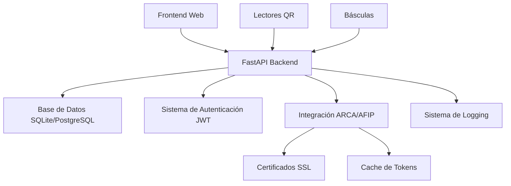
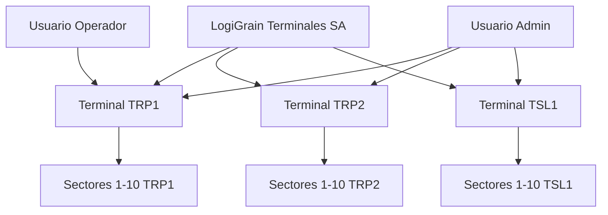
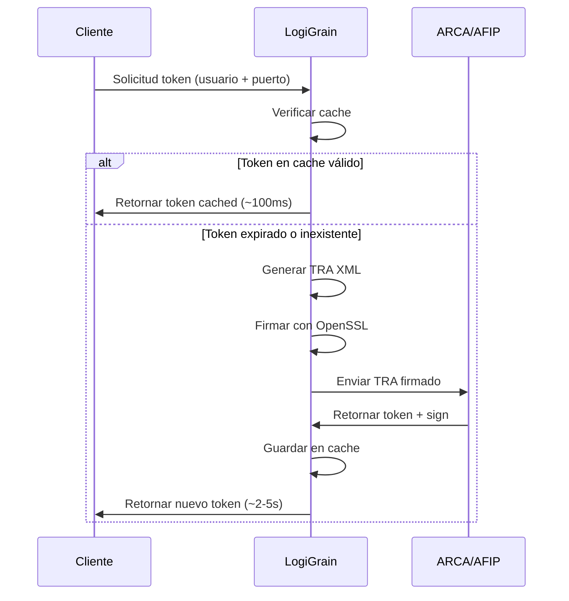
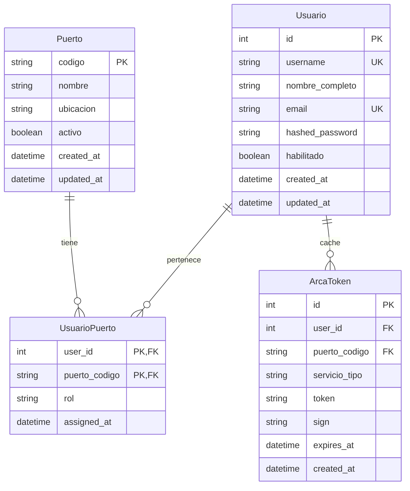

# LogiGrain - Sistema Terminal Portuaria

## 🚢 Descripción General

**LogiGrain** es un sistema integral de gestión para terminales portuarias especializadas en cereales de exportación. Automatiza el flujo completo desde la llegada de camiones hasta su salida, integrando con servicios gubernamentales argentinos (ARCA/AFIP) para validación documental y proporcionando trazabilidad completa de las operaciones.

## 🏗️ Arquitectura del Sistema

### Componentes Principales



### Stack Tecnológico

- **Backend**: Python + FastAPI
- **Base de Datos**: SQLite (desarrollo) / PostgreSQL (producción)
- **Autenticación**: JWT con tokens de 8 horas
- **Integración Externa**: ARCA/AFIP mediante WSAA + SOAP
- **Cache**: Sistema inteligente de tokens ARCA
- **Logging**: Rotación automática con múltiples loggers
- **SSL**: Certificados específicos por servicio AFIP

## 🔄 Flujo Operativo de Terminal

El sistema modela **10 sectores operativos** interconectados:


### Sectores Detallados

1. **🅿️ Playa de Camiones (20km)**: Recepción, validación ARCA, facturación
2. **🎯 Operaciones**: Monitoreo, priorización, llamado de camiones
3. **🚪 Portería Ingreso**: Control acceso, verificación documental
4. **📋 Playa Precalado**: Organización FIFO por cereal
5. **🔬 Calada**: Inspección, análisis calidad, clasificación
6. **📊 Playa Post-Calada**: Ordenamiento por calidad + FIFO
7. **⚖️ Báscula Bruto**: Registro peso bruto, asignación plataforma
8. **🚛 Plataformas Descarga**: Descarga mercadería por cereal/calidad
9. **📏 Báscula Tara**: Peso final, cálculo neto, emisión ticket
10. **🏁 Portería Salida**: Control egreso, cierre carta porte

## 🏢 Arquitectura Multipuerto

### Estructura Empresarial



### Puertos Disponibles

| Código | Nombre Completo | Ubicación | Estado |
|--------|----------------|-----------|--------|
| **TRP1** | Terminal Rosario Puerto 1 | Rosario, Santa Fe | ✅ Activo |
| **TRP2** | Terminal Rosario Puerto 2 | Rosario, Santa Fe | ✅ Activo |
| **TSL1** | Terminal San Lorenzo 1 | San Lorenzo, Santa Fe | ⚠️ En Desarrollo |

## 🔐 Sistema de Seguridad

### Autenticación JWT

- **Duración**: 8 horas por token
- **Algoritmo**: HS256
- **Verificación**: Cada endpoint requiere token válido
- **Contexto**: Token incluye información de usuario y puertos

### Autorización por Puerto

```python
# Cada operación valida acceso al puerto específico
@app.post("/api/token-cpe")
async def get_cpe_token(
    request: ArcaTokenRequest,
    current_user: Usuario = Depends(get_current_user)
):
    # Validar que usuario tiene acceso al puerto solicitado
    if not user_has_access_to_port(current_user.id, request.puerto_codigo):
        raise HTTPException(status_code=403, detail="Sin acceso al puerto")
```

## 🔗 Integración ARCA/AFIP

### Servicios Disponibles

| Servicio | Propósito | Estado |
|----------|-----------|--------|
| **CPE** | Cartas de Porte Electrónica | ✅ Funcional |
| **EMBARQUES** | Comunicaciones de Embarques | ✅ Funcional |
| **FACTURACION** | Facturación Electrónica | ✅ Funcional |

### Proceso de Autenticación ARCA



### Cache Inteligente

- **Clave triplex**: `usuario_id + puerto_codigo + servicio_tipo`
- **Duración**: 8 horas (sincronizado con JWT)
- **Performance**: ~95% de mejora en requests repetidos
- **Limpieza**: Automática de tokens expirados

## 📊 Modelos de Datos Principales

### Esquema Base



## 🚀 Instalación y Configuración

### Prerrequisitos

```bash
# Python 3.11+
python --version

# OpenSSL (para firma de certificados)
openssl version

# Git
git --version
```

### Instalación Rápida

```bash
# Clonar repositorio
git clone [repository_url] LogiGrain
cd LogiGrain

# Crear entorno virtual
python -m venv venv
venv\Scripts\activate  # Windows
# source venv/bin/activate  # Linux/Mac

# Instalar dependencias
pip install -r requirements.txt

# Configurar entorno
copy .env.example .env
# Editar .env con tus configuraciones

# Inicializar base de datos
python init_db.py

# Ejecutar aplicación
python main.py
```

### Verificación

```bash
# API corriendo en: http://127.0.0.1:8080
curl http://127.0.0.1:8080/health

# Documentación Swagger: http://127.0.0.1:8080/docs
```

## 📋 Funcionalidades Implementadas

### ✅ Completado

- **Sistema de Autenticación JWT** (8 horas duración)
- **Gestión de Usuarios y Puertos** (relación many-to-many)
- **Integración ARCA Multi-Servicio** (CPE, EMBARQUES, FACTURACION)
- **Cache Inteligente de Tokens** (mejora 95% performance)
- **Sistema de Logging Avanzado** (rotación automática, múltiples loggers)
- **Endpoints API Seguros** (JWT requerido en todos)
- **Validación de Certificados SSL** (diagnóstico automático)
- **Documentación Completa** (Swagger + docs modulares)
- **Base de Datos SQLModel** (desarrollo y producción)

### 🔄 En Progreso

- **Endpoints por Sectores Operativos** (implementación de workflow 1-10)
- **Integración QR Scanner** (lectura cartas de porte)
- **Interfaces Básculas** (peso bruto/tara)
- **Dashboard Web Frontend** (React/Vue.js)

### 📋 Planificado

- **Estados de Camiones** (trazabilidad completa por sector)
- **Sistema de Turnos** (gestión cola FIFO por cereal)
- **Reportes y Métricas** (dashboard analytics)
- **Notificaciones** (alertas tiempo real)
- **API Mobile** (aplicación móvil operadores)
- **Backup Automático** (respaldos programados)

## 🛠️ API Endpoints

### Autenticación

| Endpoint | Método | Descripción |
|----------|--------|-------------|
| `/auth/login` | POST | Login de usuarios |
| `/auth/me` | GET | Información usuario actual |

### ARCA/AFIP

| Endpoint | Método | Descripción | Cache |
|----------|--------|-------------|-------|
| `/api/token-cpe` | POST | Token Cartas Porte | ✅ 8h |
| `/api/token-embarques` | POST | Token Embarques | ✅ 8h |
| `/api/token-facturacion` | POST | Token Facturación | ✅ 8h |

### Sistema

| Endpoint | Método | Descripción |
|----------|--------|-------------|
| `/health` | GET | Estado del sistema |
| `/system-info` | GET | Información detallada |
| `/diagnose-certs` | GET | Diagnóstico certificados |

## 🏗️ Arquitectura de Desarrollo

### Estructura de Proyecto

```
LogiGrain/
├── 📄 main.py                    # FastAPI app principal
├── 📄 init_db.py                 # Inicialización BD
├── 📁 Arca/                      # Integración ARCA/AFIP
│   ├── 📄 wsaa.py               # Cliente WSAA
│   └── 📁 Pruebas/              # Tests ARCA
├── 📁 Modelos/                   # SQLModel schemas
│   ├── 📄 usuario.py            # Usuario, Puerto, relaciones
│   ├── 📄 arca_responses.py     # Responses ARCA
│   └── 📄 carta_porte.py        # Modelos carta porte
├── 📁 Ssl/                       # Certificados SSL
│   ├── 📁 cert/                 # Certificados producción
│   └── 📁 TEMP/                 # Certificados testing
├── 📁 utils/                     # Utilidades
│   └── 📄 logger.py             # Configuración logging
├── 📁 test/                      # Tests de API
├── 📁 logs/                      # Archivos de log
├── 📁 docs/                      # Documentación modular
│   ├── 📄 login.md              # Sistema autenticación
│   ├── 📄 usuarios.md           # Gestión usuarios
│   ├── 📄 puertos.md            # Gestión puertos
│   ├── 📄 arca-cache.md         # Sistema cache ARCA
│   ├── 📄 base-datos.md         # Modelos y BD
│   ├── 📄 logs.md               # Sistema logging
│   └── 📄 configuracion.md      # Setup y configuración
└── 📄 .env                       # Variables entorno
```

## 📊 Monitoreo y Métricas

### Logging Centralizado

```python
# Múltiples loggers especializados
main_logger = setup_logger('main')           # Operaciones generales
arca_logger = setup_logger('arca')           # Integración ARCA
cache_logger = setup_logger('arca-cache')    # Sistema cache
db_logger = setup_logger('database')         # Base de datos
```

### Métricas Importantes

- **Cache Hit Ratio**: ~95% en operaciones repetidas
- **Tiempo Response ARCA**: ~100ms (cached) vs ~2-5s (nuevo)
- **Concurrent Users**: Soporte múltiples usuarios simultáneos
- **Log Rotation**: 5MB por archivo, 10 archivos históricos

## 🔧 Configuración por Entorno

### Desarrollo

```bash
ENVIRONMENT=DEV
DATABASE_URL=sqlite:///./logigrain.db
ARCA_CPE_CERT_FILE=Ssl/TEMP/test_cert.crt
LOG_LEVEL=DEBUG
API_RELOAD=true
```

### Producción

```bash
ENVIRONMENT=PROD
DATABASE_URL=postgresql://user:password@db:5432/logigrain
ARCA_CPE_CERT_FILE=Ssl/cert/cpe_cert.crt
LOG_LEVEL=INFO
API_RELOAD=false
JWT_SECRET_KEY=ultra_secure_production_key
```

## 🧪 Testing

### Test Suite

```bash
# Tests de API
pytest test/test_api.py

# Tests de certificados
pytest test/test_certs.py

# Tests de endpoints
pytest test/test_get_token_endpoint.py

# Validación sistema
python validate.py
```

### Cobertura

- ✅ Autenticación JWT
- ✅ Cache de tokens ARCA
- ✅ Validación certificados
- ✅ Endpoints principales
- ⚠️ Sectores operativos (pendiente)

## 🚀 Roadmap

### Fase 1 (Actual - Base System) ✅
- Sistema de autenticación
- Integración ARCA básica  
- Cache inteligente
- Logging avanzado
- API segura

### Fase 2 (Q1 2024) 🔄
- Sectores operativos 1-10
- Estados de camiones
- QR scanning integration
- Interfaces básculas

### Fase 3 (Q2 2024) 📋
- Frontend web dashboard
- Reportes y analytics
- Sistema de turnos
- Notificaciones tiempo real

### Fase 4 (Q3 2024) 🚀
- App mobile operadores
- Integraciones adicionales
- Backup automático
- Scaling y optimización

## 🤝 Contribución

### Development Setup

```bash
# Fork del repositorio
git clone [your-fork-url]
cd LogiGrain

# Setup environment
python setup.py

# Crear rama feature
git checkout -b feature/nueva-funcionalidad

# Desarrollo y testing
pytest

# Commit y push
git commit -m "feat: descripción del cambio"
git push origin feature/nueva-funcionalidad
```

### Convenciones

- **Commits**: Seguir [Conventional Commits](https://www.conventionalcommits.org/)
- **Código**: PEP 8 con Black formatter
- **Testing**: Cobertura mínima 80%
- **Documentación**: Actualizar docs correspondientes

## 📞 Soporte

### Información de Contacto

- **Empresa**: LogiGrain Terminales SA
- **Email**: admin@logigrain.com
- **Documentación**: [docs/](docs/)
- **Issues**: GitHub Issues

### Resolución de Problemas

1. **Revisar logs**: `logs/logigrain.log`
2. **Validar configuración**: `python validate.py`
3. **Verificar certificados**: `/diagnose-certs`
4. **Consultar documentación**: [docs/](docs/)

## 📄 Licencia

Copyright (c) 2024 LogiGrain Terminales SA. Todos los derechos reservados.

Este software es propietario y confidencial. No está permitida su distribución, modificación o uso sin autorización expresa por escrito de LogiGrain Terminales SA.

---

## 🏆 Estado del Proyecto

**Versión**: 1.0.0-beta  
**Estado**: En desarrollo activo  
**Último Update**: Diciembre 2024  
**Próximo Release**: Q1 2024

¡Sistema listo para desarrollo de funcionalidades operativas! 🚢⚡