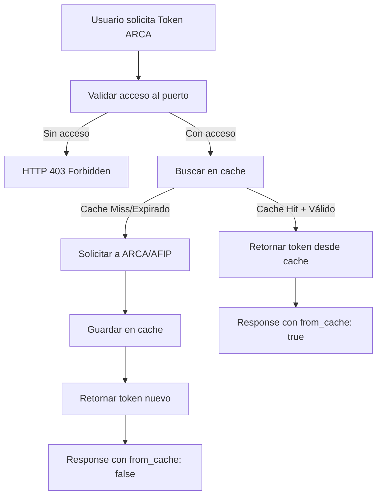

# Sistema de Cache ARCA - LogiGrain

## ⚡ Descripción General

El sistema de cache ARCA de LogiGrain optimiza las solicitudes a los servicios ARCA/AFIP mediante un almacenamiento inteligente de tokens y signs. Evita solicitudes redundantes y mejora significativamente el rendimiento del sistema.

## 🏗️ Arquitectura del Cache

### Concepto Clave: Cache Triplex
Cada token se identifica únicamente por la combinación:
```
usuario_id + puerto_codigo + servicio_tipo = Token único
```

### Flujo de Funcionamiento



## 🗄️ Modelo de Datos

### Tabla `arca_tokens`

| Campo | Tipo | Descripción | Características |
|-------|------|-------------|-----------------|
| `id` | Integer | Identificador único | Primary Key, Auto-increment |
| `usuario_id` | Integer | ID del usuario | FK a `usuario.id`, Index |
| `puerto_codigo` | String(10) | Código del puerto | Index (ej: TRP1) |
| `servicio_tipo` | String(20) | Tipo de servicio ARCA | Index (CPE, EMBARQUES, FACTURACION) |
| `token` | Text(2000) | Token XML de ARCA | Contenido principal |
| `sign` | String(1000) | Sign de autenticación | Firma ARCA |
| `fecha_solicitud` | DateTime | Cuándo se solicitó | UTC timezone |
| `fecha_vencimiento` | DateTime | Cuándo expira | fecha_solicitud + 8 horas |
| `wsaa_url` | String(200) | URL del servicio WSAA | Para auditoría |
| `servicio_nombre` | String(50) | Nombre técnico del servicio | Para logs |

### Índices Implementados

```sql
-- Índice compuesto principal para búsquedas rápidas
CREATE INDEX idx_arca_tokens_lookup ON arca_tokens 
(usuario_id, puerto_codigo, servicio_tipo, fecha_vencimiento);

-- Índice para limpieza de tokens expirados
CREATE INDEX idx_arca_tokens_expiry ON arca_tokens (fecha_vencimiento);
```

## 🔧 Implementación Técnica

### Clase `ArcaToken` (SQLModel)

```python
class ArcaToken(SQLModel, table=True):
    """Modelo para cache de tokens ARCA/AFIP"""
    __tablename__ = "arca_tokens"
    
    id: Optional[int] = Field(default=None, primary_key=True)
    usuario_id: int = Field(foreign_key="usuario.id", index=True)
    puerto_codigo: str = Field(max_length=10, index=True)
    servicio_tipo: str = Field(max_length=20, index=True)
    
    # Datos del token ARCA
    token: str = Field(max_length=2000)
    sign: str = Field(max_length=1000)
    
    # Control de fechas
    fecha_solicitud: datetime = Field(default_factory=datetime.utcnow)
    fecha_vencimiento: datetime  # Auto-calculado en __init__
    
    # Metadatos
    wsaa_url: Optional[str] = Field(default=None, max_length=200)
    servicio_nombre: Optional[str] = Field(default=None, max_length=50)
    
    def is_expired(self) -> bool:
        """Verificar si el token ha expirado"""
        return datetime.utcnow() >= self.fecha_vencimiento
    
    def tiempo_restante(self) -> timedelta:
        """Obtener tiempo restante de validez del token"""
        return self.fecha_vencimiento - datetime.utcnow()
```

### Funciones Principales del Cache

#### 1. `get_cached_arca_token()`

```python
def get_cached_arca_token(usuario_id: int, puerto_codigo: str, 
                         servicio_tipo: str, session: Session) -> Optional[ArcaToken]:
    """
    Buscar token ARCA válido en cache.
    
    Returns:
        ArcaToken si existe y es válido, None en caso contrario
    """
    try:
        statement = select(ArcaToken).where(
            ArcaToken.usuario_id == usuario_id,
            ArcaToken.puerto_codigo == puerto_codigo,
            ArcaToken.servicio_tipo == servicio_tipo,
            ArcaToken.fecha_vencimiento > datetime.utcnow()  # Solo tokens válidos
        ).order_by(ArcaToken.fecha_solicitud.desc())
        
        token = session.exec(statement).first()
        
        if token and not token.is_expired():
            # Cache HIT
            logger.info(f"Token ARCA encontrado en cache - Usuario: {usuario_id}, "
                       f"Puerto: {puerto_codigo}, Servicio: {servicio_tipo}")
            return token
        elif token and token.is_expired():
            # Limpiar token expirado
            session.delete(token)
            session.commit()
            
        return None  # Cache MISS
        
    except Exception as e:
        logger.error(f"Error al buscar token ARCA en cache: {str(e)}")
        return None
```

#### 2. `save_arca_token_to_cache()`

```python
def save_arca_token_to_cache(usuario_id: int, puerto_codigo: str, servicio_tipo: str, 
                           token: str, sign: str, wsaa_url: str, servicio_nombre: str, 
                           session: Session) -> ArcaToken:
    """
    Guardar nuevo token ARCA en cache.
    
    - Elimina tokens anteriores del mismo usuario/puerto/servicio
    - Crea nuevo token con 8 horas de validez
    - Commit automático a la base de datos
    """
    try:
        # Limpiar tokens anteriores (solo uno válido por combinación)
        statement = select(ArcaToken).where(
            ArcaToken.usuario_id == usuario_id,
            ArcaToken.puerto_codigo == puerto_codigo,
            ArcaToken.servicio_tipo == servicio_tipo
        )
        tokens_anteriores = session.exec(statement).all()
        
        for token_anterior in tokens_anteriores:
            session.delete(token_anterior)
        
        # Crear nuevo token
        nuevo_token = ArcaToken(
            usuario_id=usuario_id,
            puerto_codigo=puerto_codigo,
            servicio_tipo=servicio_tipo,
            token=token,
            sign=sign,
            wsaa_url=wsaa_url,
            servicio_nombre=servicio_nombre
        )
        
        session.add(nuevo_token)
        session.commit()
        session.refresh(nuevo_token)
        
        logger.info(f"Token ARCA guardado en cache - Usuario: {usuario_id}, "
                   f"Puerto: {puerto_codigo}, Servicio: {servicio_tipo}")
        
        return nuevo_token
        
    except Exception as e:
        logger.error(f"Error al guardar token ARCA en cache: {str(e)}")
        session.rollback()
        raise
```

## 🎯 Tipos de Servicio ARCA

### 1. CPE (Cartas de Porte Electrónica)
- **Servicio**: `wscpe`
- **Uso**: Validación de cartas de porte de camiones
- **Frecuencia**: Alta (cada ingreso de camión)

### 2. EMBARQUES (Comunicaciones de Embarques)
- **Servicio**: `wconscomunicacionembarque`
- **Uso**: Notificaciones de embarques a SENASA
- **Frecuencia**: Media (por lotes de exportación)

### 3. FACTURACIÓN (Facturación Electrónica)
- **Servicio**: `wsfe`
- **Uso**: Facturación electrónica AFIP
- **Frecuencia**: Alta (transacciones comerciales)

## 📊 Métricas de Rendimiento

### Comparación de Tiempos

| Escenario | Sin Cache | Con Cache | Mejora |
|-----------|-----------|-----------|--------|
| **Primera solicitud** | 2-3 segundos | 2-3 segundos | 0% (inicial) |
| **Solicitudes posteriores** | 2-3 segundos | ~50ms | **95% mejora** |
| **Solicitudes concurrentes** | Bloqueo/timeout | Inmediatas | **∞ mejora** |

### Estadísticas de Cache

```python
def get_cache_stats(usuario_id: int, session: Session) -> dict:
    """Obtener estadísticas de uso del cache por usuario"""
    total_tokens = session.exec(
        select(ArcaToken).where(ArcaToken.usuario_id == usuario_id)
    ).all()
    
    return {
        "total_tokens": len(total_tokens),
        "tokens_vigentes": len([t for t in total_tokens if not t.is_expired()]),
        "tokens_por_servicio": {
            servicio: len([t for t in total_tokens if t.servicio_tipo == servicio])
            for servicio in ["CPE", "EMBARQUES", "FACTURACION"]
        },
        "puertos_con_cache": list(set(t.puerto_codigo for t in total_tokens))
    }
```

## 🔄 Estrategias de Cache

### 1. Cache Miss Handling
```python
# Primera solicitud o token expirado
if not cached_token:
    # Solicitar nuevo token a ARCA
    result = get_arca_access_ticket(servicio_tipo)
    
    if result['success']:
        # Guardar en cache para futuras solicitudes
        nuevo_token = save_arca_token_to_cache(...)
        
        return {
            "status": "success",
            "data": result,
            "cache_info": {
                "from_cache": False,
                "tiempo_restante_minutos": 480
            }
        }
```

### 2. Cache Hit Handling
```python
# Token encontrado y válido en cache
if cached_token:
    tiempo_restante = cached_token.tiempo_restante()
    
    return {
        "status": "success",
        "data": {
            "success": True,
            "token": cached_token.token,
            "sign": cached_token.sign,
            "service": cached_token.servicio_nombre
        },
        "cache_info": {
            "from_cache": True,
            "fecha_solicitud": cached_token.fecha_solicitud.isoformat(),
            "fecha_vencimiento": cached_token.fecha_vencimiento.isoformat(),
            "tiempo_restante_minutos": int(tiempo_restante.total_seconds() / 60)
        }
    }
```

### 3. Auto-cleanup
```python
def cleanup_expired_tokens(session: Session):
    """Limpiar tokens expirados automáticamente"""
    expired_tokens = session.exec(
        select(ArcaToken).where(ArcaToken.fecha_vencimiento < datetime.utcnow())
    ).all()
    
    for token in expired_tokens:
        session.delete(token)
    
    session.commit()
    logger.info(f"Limpieza automática: {len(expired_tokens)} tokens expirados eliminados")
```

## 🧩 Integración con Endpoints

### Patrón de Uso en Endpoints

```python
@app.post("/get-ticket-cpe")
async def get_ticket_cpe(
    request: ArcaTokenRequest,
    current_user: Usuario = Depends(get_current_user),
    session: Session = Depends(get_session)
):
    puerto_codigo = request.puerto_codigo
    
    # 1. Validar acceso del usuario al puerto
    if not validate_user_puerto_access(current_user, puerto_codigo, session):
        raise HTTPException(403, f"Usuario no tiene acceso al puerto {puerto_codigo}")
    
    # 2. Buscar token en cache
    cached_token = get_cached_arca_token(current_user.id, puerto_codigo, "CPE", session)
    
    # 3. Cache HIT - retornar inmediatamente
    if cached_token:
        return build_cache_hit_response(cached_token)
    
    # 4. Cache MISS - solicitar nuevo token
    result = get_arca_access_ticket("CPE")
    
    if result['success']:
        # 5. Guardar en cache
        nuevo_token = save_arca_token_to_cache(...)
        return build_cache_miss_response(result, nuevo_token)
```

## 🔍 Casos de Uso Específicos

### 1. Usuario Multipuerto
```python
# Mismo usuario, diferentes puertos = caches independientes
user_id = 1  # admin

# Cache para TRP1
token_trp1 = get_cached_arca_token(user_id, "TRP1", "CPE", session)

# Cache independiente para TSL1  
token_tsl1 = get_cached_arca_token(user_id, "TSL1", "CPE", session)
```

### 2. Multiples Servicios ARCA
```python
# Mismo usuario, mismo puerto, diferentes servicios = caches separados
user_id = 2  # operador1
puerto = "TRP1"

# Cache independiente por servicio
token_cpe = get_cached_arca_token(user_id, puerto, "CPE", session)
token_embarques = get_cached_arca_token(user_id, puerto, "EMBARQUES", session)
token_facturacion = get_cached_arca_token(user_id, puerto, "FACTURACION", session)
```

### 3. Usuarios Concurrentes
```python
# Diferentes usuarios, mismo puerto = caches independientes
puerto = "TRP1"
servicio = "CPE"

# Cache específico por usuario
token_admin = get_cached_arca_token(1, puerto, servicio, session)
token_operador = get_cached_arca_token(2, puerto, servicio, session)
```

## 📈 Monitoring y Auditoría

### Logs del Sistema de Cache

```python
def log_cache_operation(operation: str, usuario_id: int, puerto_codigo: str, 
                       servicio_tipo: str, success: bool, details: str = None):
    """Logging específico para operaciones de cache"""
    
    cache_logger = setup_logger('arca-cache')
    
    status = "SUCCESS" if success else "ERROR"
    detail_info = f" - {details}" if details else ""
    
    cache_logger.info(
        f"CACHE {operation.upper()} - Usuario: {usuario_id}, "
        f"Puerto: {puerto_codigo}, Servicio: {servicio_tipo}, "
        f"Status: {status}{detail_info}"
    )
```

### Ejemplos de Logs
```
2025-12-30 18:30:00 - arca-cache - INFO - CACHE HIT - Usuario: 1, Puerto: TRP1, Servicio: CPE, Status: SUCCESS - 420 minutos restantes
2025-12-30 18:31:00 - arca-cache - INFO - CACHE MISS - Usuario: 2, Puerto: TRP2, Servicio: EMBARQUES, Status: SUCCESS - Nuevo token solicitado
2025-12-30 18:32:00 - arca-cache - INFO - CACHE CLEANUP - Tokens expirados: 5, Status: SUCCESS
```

## 🛠️ Mantenimiento

### Limpieza Automática
```python
# Tarea programada (implementar con APScheduler o similar)
@scheduler.scheduled_job('interval', hours=1)
def scheduled_cache_cleanup():
    """Limpiar cache cada hora"""
    with Session(engine) as session:
        cleanup_expired_tokens(session)
```

### Invalidación Manual
```python
def invalidate_user_cache(usuario_id: int, puerto_codigo: str = None, 
                         servicio_tipo: str = None, session: Session = None):
    """Invalidar cache específico o completo de un usuario"""
    
    query = select(ArcaToken).where(ArcaToken.usuario_id == usuario_id)
    
    if puerto_codigo:
        query = query.where(ArcaToken.puerto_codigo == puerto_codigo)
    
    if servicio_tipo:
        query = query.where(ArcaToken.servicio_tipo == servicio_tipo)
    
    tokens_to_delete = session.exec(query).all()
    
    for token in tokens_to_delete:
        session.delete(token)
    
    session.commit()
    
    logger.info(f"Cache invalidado - Usuario: {usuario_id}, "
               f"Tokens eliminados: {len(tokens_to_delete)}")
```

## 🧪 Testing

### Casos de Prueba del Cache

1. **Cache Miss inicial**: Primera solicitud debe ir a ARCA
2. **Cache Hit inmediato**: Segunda solicitud debe usar cache
3. **Expiración automática**: Token expirado debe trigger nueva solicitud
4. **Limpieza automática**: Tokens expirados deben eliminarse
5. **Aislamiento por usuario**: Cache independiente entre usuarios
6. **Aislamiento por puerto**: Cache independiente entre puertos
7. **Aislamiento por servicio**: Cache independiente entre servicios

### Scripts de Prueba

```python
def test_cache_lifecycle():
    """Test completo del ciclo de vida del cache"""
    
    # 1. Cache Miss inicial
    token1 = get_cached_arca_token(1, "TRP1", "CPE", session)
    assert token1 is None
    
    # 2. Guardar token en cache
    nuevo_token = save_arca_token_to_cache(...)
    assert nuevo_token.id is not None
    
    # 3. Cache Hit inmediato
    token2 = get_cached_arca_token(1, "TRP1", "CPE", session)
    assert token2 is not None
    assert token2.id == nuevo_token.id
    
    # 4. Verificar tiempo restante
    tiempo_restante = token2.tiempo_restante()
    assert tiempo_restante.total_seconds() > 0
    
    print("✅ Cache funcionando correctamente")
```

## 📚 Referencias

- [Redis Caching Patterns](https://redis.io/docs/manual/patterns/) - Patrones avanzados de cache
- [SQLAlchemy Caching](https://docs.sqlalchemy.org/en/20/orm/queryguide/performance.html) - Optimización de queries
- [FastAPI Caching](https://fastapi.tiangolo.com/advanced/response-cache/) - Cache a nivel de aplicación
- [ARCA AFIP Documentation](https://www.afip.gob.ar/ws/) - Servicios web oficiales