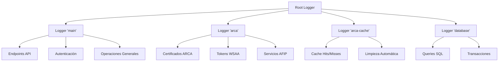

# Sistema de Logging - LogiGrain

## 📝 Descripción General

El sistema de logging de LogiGrain proporciona trazabilidad completa y auditoría de todas las operaciones del sistema. Utiliza el módulo `logging` de Python con configuración centralizada, rotación automática de archivos y múltiples loggers especializados.

## 🏗️ Arquitectura de Logging

### Estructura de Loggers



## 🔧 Configuración Centralizada

### Archivo `utils/logger.py`

```python
import logging
import os
from logging.handlers import RotatingFileHandler
from pathlib import Path

def setup_logger(name: str, level: int = logging.INFO) -> logging.Logger:
    """
    Configurar logger centralizado con rotación automática
    
    Args:
        name: Nombre del logger ('main', 'arca', 'arca-cache', etc.)
        level: Nivel de logging (INFO por defecto)
        
    Returns:
        Logger configurado y listo para usar
    """
    
    # Crear directorio de logs si no existe
    log_dir = Path("logs")
    log_dir.mkdir(exist_ok=True)
    
    # Configurar logger
    logger = logging.getLogger(name)
    logger.setLevel(level)
    
    # Evitar duplicar handlers si ya existe
    if logger.handlers:
        return logger
    
    # Formato detallado
    formatter = logging.Formatter(
        '%(asctime)s - %(name)s - %(levelname)s - %(message)s',
        datefmt='%Y-%m-%d %H:%M:%S'
    )
    
    # Handler para archivo con rotación automática
    file_handler = RotatingFileHandler(
        filename=log_dir / "logigrain.log",
        maxBytes=5 * 1024 * 1024,  # 5MB por archivo
        backupCount=10,            # Mantener 10 archivos históricos
        encoding='utf-8'
    )
    file_handler.setFormatter(formatter)
    logger.addHandler(file_handler)
    
    # Handler para consola (solo en desarrollo)
    if os.getenv("ENVIRONMENT", "DEV") == "DEV":
        console_handler = logging.StreamHandler()
        console_handler.setFormatter(formatter)
        logger.addHandler(console_handler)
    
    return logger
```

### Configuración por Ambiente

```python
# Configuración diferenciada por entorno
LOG_LEVELS = {
    "DEV": logging.DEBUG,
    "TEST": logging.WARNING, 
    "PROD": logging.INFO
}

ENVIRONMENT = os.getenv("ENVIRONMENT", "DEV")
log_level = LOG_LEVELS.get(ENVIRONMENT, logging.INFO)
```

## 📊 Loggers Especializados

### 1. Logger `'main'` - Operaciones Principales

**Propósito**: Logging general del sistema, endpoints, autenticación

```python
# main.py
logger = setup_logger('main')

# Eventos registrados:
logger.info(f"Intento de login para usuario: {username}")
logger.info(f"Login exitoso para usuario: {username}")
logger.warning(f"Usuario deshabilitado: {username}")
logger.error(f"Error inesperado en login: {str(e)}")
```

**Tipos de Eventos**:
- ✅ **Login exitoso/fallido**
- 🚪 **Inicio/cierre de sesiones**
- 🌐 **Requests a endpoints**
- ⚠️ **Errores de validación**
- 🔒 **Problemas de autorización**

### 2. Logger `'arca'` - Integración ARCA/AFIP

**Propósito**: Operaciones específicas de ARCA, certificados, WSAA

```python
# Arca/wsaa.py
arca_logger = setup_logger('arca')

# Eventos registrados:
arca_logger.info(f"Iniciando autenticación ARCA - Tipo: '{service_type}'")
arca_logger.info(f"Configuración obtenida: servicio={config.service_name}")
arca_logger.info(f"Validación de certificados completada")
arca_logger.info(f"TRA XML generado exitosamente")
arca_logger.error(f"Error en firma CMS: {str(e)}")
```

**Eventos Específicos**:
- 🔐 **Carga de certificados SSL**
- 📝 **Generación de TRA XML**
- ✍️ **Firma CMS con OpenSSL**
- 🌐 **Llamadas WSAA**
- 🎫 **Obtención de tokens y signs**

### 3. Logger `'arca-cache'` - Sistema de Cache

**Propósito**: Operaciones del cache de tokens ARCA

```python
# main.py - funciones de cache
cache_logger = setup_logger('arca-cache')

# Eventos registrados:
cache_logger.info(f"Token ARCA encontrado en cache - Usuario: {user_id}")
cache_logger.info(f"Token ARCA guardado en cache - Usuario: {user_id}")
cache_logger.info(f"Limpieza automática: {len(expired)} tokens eliminados")
```

**Métricas de Cache**:
- 🎯 **Cache hits/misses**
- 💾 **Guardado de nuevos tokens**
- 🗑️ **Limpieza automática**
- ⏱️ **Tiempo restante de tokens**

### 4. Logger `'database'` - Operaciones de BD

**Propósito**: Queries, transacciones, errores de base de datos

```python
# Para operaciones críticas de BD
db_logger = setup_logger('database')

db_logger.info(f"Usuario creado: ID {user.id}, Username: {user.username}")
db_logger.warning(f"Query lenta detectada: {execution_time}s")
db_logger.error(f"Error en transacción: {str(e)}")
```

## 📁 Estructura de Archivos de Log

### Archivo Principal: `logs/logigrain.log`

```
logs/
├── logigrain.log          # Archivo activo (hasta 5MB)
├── logigrain.log.1        # Archivo rotado más reciente  
├── logigrain.log.2        # Archivo rotado anterior
├── ...
├── logigrain.log.10       # Archivo más antiguo (se elimina al rotar)
└── README.md              # Documentación específica de logs
```

### Rotación Automática

- **Tamaño máximo**: 5MB por archivo
- **Archivos históricos**: 10 archivos mantenidos
- **Política**: Rotación automática cuando se alcanza el límite
- **Total storage**: ~50MB máximo para todos los logs

## 🎯 Logging por Funcionalidad

### Autenticación y Autorización

```python
# Intentos de login
logger.info(f"Intento de login para usuario: {username}")

# Login exitoso
logger.info(f"Login exitoso para usuario: {username}")

# Errores de autenticación
logger.warning(f"Usuario no encontrado: {username}")
logger.warning(f"Contraseña incorrecta para usuario: {username}")
logger.warning(f"Usuario deshabilitado: {username}")

# Problemas de autorización
logger.warning(f"Usuario sin puertos asignados: {username}")
logger.error(f"Token inválido para usuario: {username}")
```

### Operaciones ARCA/AFIP

```python
# Inicio de proceso ARCA
arca_logger.info(f"Iniciando autenticación ARCA - Tipo: 'CPE', Entorno: 'PROD'")

# Configuración
arca_logger.info(f"Configuración obtenida: servicio=wscpe, cert=path/to/cert.crt")

# Validaciones
arca_logger.info(f"Validación de certificados completada")
arca_logger.error(f"Error al validar certificado: {error_msg}")

# Proceso de firma
arca_logger.info(f"TRA XML generado exitosamente")
arca_logger.info(f"Firmando TRA con OpenSSL CLI")
arca_logger.info(f"OpenSSL ejecutado exitosamente")

# Comunicación WSAA
arca_logger.info(f"Llamando WSAA: https://wsaa.afip.gov.ar/ws/services/LoginCms")
arca_logger.info(f"Respuesta WSAA recibida exitosamente")
arca_logger.info(f"Autenticación ARCA completada exitosamente")
```

### Sistema de Cache

```python
# Cache hit
cache_logger.info(f"CACHE HIT - Usuario: {user_id}, Puerto: {puerto_codigo}, "
                 f"Servicio: {servicio_tipo}, Tiempo restante: {minutos}min")

# Cache miss
cache_logger.info(f"CACHE MISS - Usuario: {user_id}, Puerto: {puerto_codigo}, "
                 f"Servicio: {servicio_tipo}, Solicitando nuevo token")

# Guardado en cache
cache_logger.info(f"CACHE SAVE - Token guardado para Usuario: {user_id}, "
                 f"Puerto: {puerto_codigo}, Vence: {fecha_vencimiento}")

# Limpieza automática
cache_logger.info(f"CACHE CLEANUP - {count} tokens expirados eliminados")
```

### Endpoints API

```python
# Formato estándar para endpoints
def log_endpoint_access(action: str, usuario: Usuario, puerto_codigo: str = None, 
                       success: bool = True, details: str = None):
    """Logging estándar para todos los endpoints"""
    
    status_msg = "ÉXITO" if success else "FRACASO"
    puerto_info = f", Puerto: {puerto_codigo}" if puerto_codigo else ""
    detail_info = f", Detalles: {details}" if details else ""
    
    logger.info(f"ENDPOINT ACCESS - Usuario: {usuario.username} (ID: {usuario.id})"
               f"{puerto_info}, Acción: {action}, Estado: {status_msg}{detail_info}")

# Ejemplos de uso:
log_endpoint_access("Solicitud Token CPE", current_user, "TRP1", True)
log_endpoint_access("Token CPE - Cache Hit", current_user, "TRP1", True, 
                   "Token reutilizado, vence en 420 minutos")
```

## 📊 Análisis y Monitoreo de Logs

### Patrones de Búsqueda

```bash
# Buscar errores específicos
grep "ERROR" logs/logigrain.log

# Filtrar por usuario
grep "Usuario: admin" logs/logigrain.log

# Operaciones de cache
grep "CACHE" logs/logigrain.log

# Solicitudes ARCA
grep "ARCA" logs/logigrain.log

# Problemas de autenticación
grep "Login\|Token\|AUTH" logs/logigrain.log
```

### Métricas Importantes

#### 1. Actividad de Usuarios
```bash
# Logins por usuario
grep "Login exitoso" logs/logigrain.log | cut -d':' -f4 | sort | uniq -c

# Actividad por puerto
grep "Puerto:" logs/logigrain.log | grep -o "Puerto: [A-Z0-9]*" | sort | uniq -c
```

#### 2. Performance de Cache
```bash
# Ratio de cache hits
cache_hits=$(grep "CACHE HIT" logs/logigrain.log | wc -l)
cache_misses=$(grep "CACHE MISS" logs/logigrain.log | wc -l)
ratio=$((cache_hits * 100 / (cache_hits + cache_misses)))
echo "Cache hit ratio: ${ratio}%"
```

#### 3. Errores y Problemas
```bash
# Top errores
grep "ERROR\|WARNING" logs/logigrain.log | cut -d'-' -f4- | sort | uniq -c | sort -nr

# Errores ARCA específicos
grep "arca.*ERROR" logs/logigrain.log
```

## 🔧 Configuración Avanzada

### Logging Estructurado (JSON)

```python
import json
from datetime import datetime

class JSONFormatter(logging.Formatter):
    """Formatter para logs estructurados en JSON"""
    
    def format(self, record):
        log_entry = {
            "timestamp": datetime.utcnow().isoformat(),
            "level": record.levelname,
            "logger": record.name,
            "message": record.getMessage(),
            "module": record.module,
            "function": record.funcName,
            "line": record.lineno
        }
        
        # Agregar contexto adicional si existe
        if hasattr(record, 'user_id'):
            log_entry['user_id'] = record.user_id
        if hasattr(record, 'puerto_codigo'):
            log_entry['puerto_codigo'] = record.puerto_codigo
            
        return json.dumps(log_entry, ensure_ascii=False)

# Uso con context
def log_with_context(logger, user_id, puerto_codigo, message):
    """Logging con contexto adicional"""
    extra = {'user_id': user_id, 'puerto_codigo': puerto_codigo}
    logger.info(message, extra=extra)
```

### Integración con Sistemas Externos

```python
# Handler para enviar logs críticos por email
import smtplib
from logging.handlers import SMTPHandler

def setup_email_alerts():
    """Configurar alertas por email para errores críticos"""
    
    if os.getenv("ENVIRONMENT") == "PROD":
        smtp_handler = SMTPHandler(
            mailhost=('smtp.gmail.com', 587),
            fromaddr='logigrain@company.com',
            toaddrs=['admin@company.com'],
            subject='LogiGrain - Error Crítico',
            credentials=('user', 'password'),
            secure=()
        )
        smtp_handler.setLevel(logging.ERROR)
        
        # Agregar a logger principal
        main_logger = logging.getLogger('main')
        main_logger.addHandler(smtp_handler)
```

### Performance Monitoring

```python
import time
import functools

def log_execution_time(logger):
    """Decorator para medir y loggear tiempo de ejecución"""
    
    def decorator(func):
        @functools.wraps(func)
        def wrapper(*args, **kwargs):
            start_time = time.time()
            result = func(*args, **kwargs)
            execution_time = time.time() - start_time
            
            if execution_time > 1.0:  # Log operaciones lentas
                logger.warning(f"{func.__name__} ejecutó en {execution_time:.2f}s")
            else:
                logger.debug(f"{func.__name__} ejecutó en {execution_time:.3f}s")
                
            return result
        return wrapper
    return decorator

# Uso
@log_execution_time(arca_logger)
def get_arca_access_ticket(service_type):
    # ... operación ARCA
    pass
```

## 🧹 Mantenimiento de Logs

### Rotación Manual

```python
def force_log_rotation():
    """Forzar rotación de logs manualmente"""
    for handler in logging.getLogger('main').handlers:
        if isinstance(handler, RotatingFileHandler):
            handler.doRollover()
            logger.info("Rotación manual de logs ejecutada")
```

### Compresión de Logs Antiguos

```python
import gzip
import shutil
from pathlib import Path

def compress_old_logs():
    """Comprimir logs antiguos para ahorrar espacio"""
    log_dir = Path("logs")
    
    for log_file in log_dir.glob("logigrain.log.*"):
        if not log_file.name.endswith('.gz'):
            with open(log_file, 'rb') as f_in:
                with gzip.open(f"{log_file}.gz", 'wb') as f_out:
                    shutil.copyfileobj(f_in, f_out)
            
            log_file.unlink()  # Eliminar archivo sin comprimir
            logger.info(f"Log comprimido: {log_file.name}.gz")
```

### Limpieza Automática

```python
def cleanup_old_logs(max_age_days=30):
    """Eliminar logs más antiguos que X días"""
    from datetime import datetime, timedelta
    
    cutoff_date = datetime.now() - timedelta(days=max_age_days)
    log_dir = Path("logs")
    
    for log_file in log_dir.glob("*.gz"):
        if log_file.stat().st_mtime < cutoff_date.timestamp():
            log_file.unlink()
            logger.info(f"Log antiguo eliminado: {log_file.name}")
```

## 📈 Dashboard de Logs (Futuro)

### Integración con Grafana/ELK Stack

```python
# Configuración para envío a Elasticsearch
from pythonjsonlogger import jsonlogger

def setup_elasticsearch_logging():
    """Configurar envío de logs a Elasticsearch"""
    
    json_handler = logging.StreamHandler()
    formatter = jsonlogger.JsonFormatter(
        '%(asctime)s %(name)s %(levelname)s %(message)s'
    )
    json_handler.setFormatter(formatter)
    
    # Configurar para todos los loggers
    for logger_name in ['main', 'arca', 'arca-cache']:
        logger = logging.getLogger(logger_name)
        logger.addHandler(json_handler)
```

### Métricas en Tiempo Real

```python
def generate_log_metrics():
    """Generar métricas en tiempo real desde logs"""
    return {
        "total_requests_last_hour": count_requests_last_hour(),
        "error_rate_percent": calculate_error_rate(),
        "cache_hit_ratio": calculate_cache_ratio(),
        "active_users": count_active_users(),
        "arca_response_time_avg": get_avg_arca_response_time()
    }
```

## 🧪 Testing de Logs

### Test Cases

```python
import pytest
import logging
from io import StringIO

def test_logger_configuration():
    """Test configuración básica del logger"""
    logger = setup_logger('test')
    
    assert logger.level == logging.INFO
    assert len(logger.handlers) > 0

def test_log_formatting():
    """Test formato de mensajes de log"""
    # Capturar output
    stream = StringIO()
    handler = logging.StreamHandler(stream)
    
    test_logger = logging.getLogger('test_format')
    test_logger.addHandler(handler)
    test_logger.setLevel(logging.INFO)
    
    test_logger.info("Test message")
    
    log_output = stream.getvalue()
    assert "test_format" in log_output
    assert "INFO" in log_output
    assert "Test message" in log_output

def test_log_rotation():
    """Test rotación automática de archivos"""
    # Crear logger con límite pequeño para testing
    pass  # Implementar test específico
```

## 🚨 Troubleshooting

### Problemas Comunes

#### 1. Archivos de Log Muy Grandes
**Síntoma**: Disco lleno por logs excesivos
**Solución**:
```python
# Reducir tamaño máximo o cantidad de backups
file_handler = RotatingFileHandler(
    maxBytes=1 * 1024 * 1024,  # 1MB en lugar de 5MB
    backupCount=5              # 5 archivos en lugar de 10
)
```

#### 2. Logs No Aparecen
**Síntoma**: No se generan logs esperados
**Diagnóstico**:
```python
# Verificar configuración
logger = logging.getLogger('main')
print(f"Logger level: {logger.level}")
print(f"Handlers: {[type(h).__name__ for h in logger.handlers]}")
print(f"Effective level: {logger.getEffectiveLevel()}")
```

#### 3. Encoding Issues
**Síntoma**: Caracteres especiales corruptos
**Solución**:
```python
file_handler = RotatingFileHandler(
    filename="logs/logigrain.log",
    encoding='utf-8'  # Especificar encoding explícitamente
)
```

## 📚 Referencias

- [Python Logging Documentation](https://docs.python.org/3/library/logging.html) - Documentación oficial
- [Logging Best Practices](https://docs.python-guide.org/writing/logging/) - Guía de mejores prácticas
- [RotatingFileHandler](https://docs.python.org/3/library/logging.handlers.html#rotatingfilehandler) - Rotación automática
- [Structured Logging](https://structlog.org/) - Logging estructurado avanzado
- [ELK Stack](https://www.elastic.co/what-is/elk-stack) - Para análisis avanzado de logs