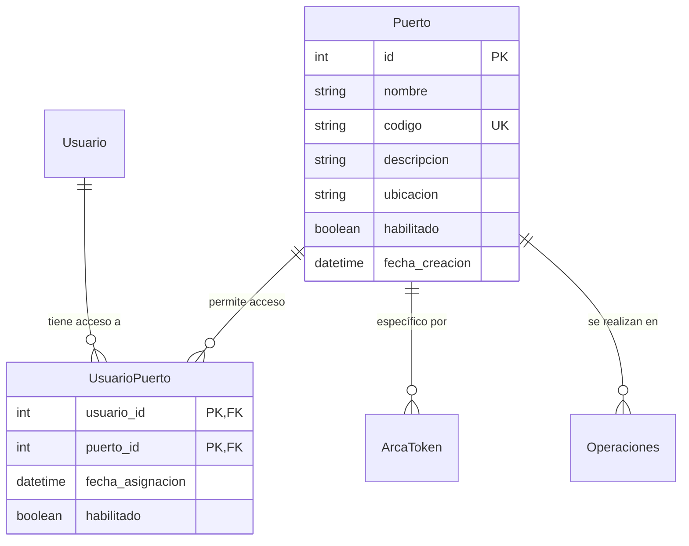

# Sistema de Puertos - LogiGrain

## 🏢 Descripción General

El sistema de puertos de LogiGrain gestiona las diferentes terminales portuarias de la empresa. Permite administrar múltiples ubicaciones físicas, cada una con sus propias operaciones, usuarios y configuraciones específicas.

## 🏗️ Modelo de Datos

### Tabla `puerto`

| Campo | Tipo | Descripción | Características |
|-------|------|-------------|-----------------|
| `id` | Integer | Identificador único | Primary Key, Auto-increment |
| `nombre` | String(100) | Nombre descriptivo del puerto | Obligatorio |
| `codigo` | String(10) | Código único del puerto | Unique, Index (ej: TRP1) |
| `descripcion` | String(255) | Descripción detallada | Opcional |
| `ubicacion` | String(255) | Ubicación geográfica | Opcional |
| `habilitado` | Boolean | Estado operativo | Default: True |
| `fecha_creacion` | DateTime | Fecha de creación | Auto-generado |

### Códigos de Puerto Estándar

| Código | Nombre | Ubicación | Descripción |
|--------|--------|-----------|-------------|
| **TRP1** | Terminal Rosario Puerto 1 | Puerto de Rosario - Zona Norte | Terminal principal de cereales |
| **TRP2** | Terminal Rosario Puerto 2 | Puerto de Rosario - Zona Sur | Terminal secundario, granos especiales |
| **TSL1** | Terminal San Lorenzo 1 | Puerto San Lorenzo | Terminal de exportación, alta capacidad |

## 🔗 Relaciones del Sistema



## 🏗️ Estructura Organizacional

### Modelo de Negocio Multipuerto

LogiGrain opera con **múltiples terminales portuarias**, cada una funcionando como una unidad de negocio semi-independiente:

```
LogiGrain (Empresa)
├── TRP1 (Terminal Rosario Puerto 1)
│   ├── Operadores específicos
│   ├── Sectores operativos (1-10)
│   └── Certificados ARCA específicos
├── TRP2 (Terminal Rosario Puerto 2)
│   ├── Personal especializado
│   └── Operaciones diferenciadas
└── TSL1 (Terminal San Lorenzo 1)
    ├── Gerencia local
    └── Capacidad de exportación
```

## 🔧 Funcionalidades del Modelo

### Clase `Puerto` (SQLModel)

```python
class Puerto(SQLModel, table=True):
    """Modelo para puertos/unidades de negocio"""
    id: int = Field(default=None, primary_key=True)
    nombre: str = Field(max_length=100)
    codigo: str = Field(max_length=10, unique=True)  # Ej: "TRP1", "TRP2"
    descripcion: Optional[str] = Field(default=None, max_length=255)
    ubicacion: Optional[str] = Field(default=None, max_length=255)
    habilitado: bool = Field(default=True)
    fecha_creacion: datetime = Field(default_factory=datetime.utcnow)
    
    # Relación con usuarios
    usuarios: List["UsuarioPuerto"] = Relationship(back_populates="puerto")
```

### Validaciones Automáticas

```python
def validate_puerto_codigo(codigo: str) -> bool:
    """Validar formato del código de puerto"""
    import re
    # Formato: 3 letras + 1 número (ej: TRP1, TSL1)
    pattern = r'^[A-Z]{3}\d{1}$'
    return bool(re.match(pattern, codigo))
```

## 👥 Sistema de Asignación de Usuarios

### Tabla de Relación `UsuarioPuerto`

```python
class UsuarioPuerto(SQLModel, table=True):
    """Tabla de relación Usuario-Puerto (Many-to-Many)"""
    usuario_id: int = Field(foreign_key="usuario.id", primary_key=True)
    puerto_id: int = Field(foreign_key="puerto.id", primary_key=True)
    fecha_asignacion: datetime = Field(default_factory=datetime.utcnow)
    habilitado: bool = Field(default=True)
    
    # Relaciones
    usuario: Usuario = Relationship(back_populates="puertos")
    puerto: Puerto = Relationship(back_populates="usuarios")
```

### Asignaciones por Rol

#### Administrador (`admin`)
- **Acceso**: Todos los puertos (`TRP1`, `TRP2`, `TSL1`)
- **Justificación**: Supervisión general del sistema
- **Permisos**: Configuración, diagnóstico, gestión global

#### Operador (`operador1`)
- **Acceso**: `TRP1`, `TRP2`
- **Justificación**: Personal operativo de Rosario
- **Permisos**: Operaciones diarias, ingreso de datos

#### Supervisor (`supervisor`)
- **Acceso**: `TRP2`, `TSL1`
- **Justificación**: Supervisión regional entre terminales
- **Permisos**: Monitoreo, reportes, coordinación

#### Gerente (`gerente`)
- **Acceso**: `TSL1`
- **Justificación**: Gerencia local específica
- **Permisos**: Gestión ejecutiva, decisiones locales

## 🔒 Validación de Permisos por Puerto

### Función de Validación

```python
def validate_user_puerto_access(usuario: Usuario, puerto_codigo: str, session: Session) -> bool:
    """
    Validar que el usuario tenga acceso al puerto especificado.
    
    Args:
        usuario: Usuario autenticado
        puerto_codigo: Código del puerto a validar (ej: "TRP1")
        session: Sesión de base de datos
        
    Returns:
        bool: True si tiene acceso, False en caso contrario
    """
    try:
        statement = select(UsuarioPuerto, Puerto).join(Puerto).where(
            UsuarioPuerto.usuario_id == usuario.id,
            Puerto.codigo == puerto_codigo,
            UsuarioPuerto.habilitado == True,
            Puerto.habilitado == True
        )
        
        resultado = session.exec(statement).first()
        return resultado is not None
        
    except Exception as e:
        logger.error(f"Error al validar acceso a puerto: {str(e)}")
        return False
```

### Uso en Endpoints

```python
@app.post("/get-ticket-cpe")
async def get_ticket_cpe(
    request: ArcaTokenRequest,
    current_user: Usuario = Depends(get_current_user)
):
    puerto_codigo = request.puerto_codigo
    
    # Validar acceso del usuario al puerto
    if not validate_user_puerto_access(current_user, puerto_codigo, session):
        raise HTTPException(
            status_code=403, 
            detail=f"Usuario no tiene acceso al puerto {puerto_codigo}"
        )
```

## 🎯 Casos de Uso Específicos

### 1. Solicitud de Token ARCA por Puerto
Cada puerto maneja sus propios tokens ARCA/AFIP:

```json
// Usuario admin solicita token para TRP1
POST /get-ticket-cpe
{
  "puerto_codigo": "TRP1"
}

// El mismo usuario puede solicitar para TSL1
POST /get-ticket-cpe  
{
  "puerto_codigo": "TSL1"
}
```

### 2. Operaciones Específicas por Terminal
```python
# Ingreso de camión específico por puerto
def ingresar_camion(camion_data, puerto_codigo, usuario):
    if not validate_user_puerto_access(usuario, puerto_codigo, session):
        raise HTTPException(403, "Sin acceso al puerto")
    
    # Procesar ingreso en el puerto específico
    ...
```

### 3. Reportes por Terminal
```python
def generar_reporte_puerto(puerto_codigo, fecha_desde, fecha_hasta, usuario):
    # Validar acceso
    if not validate_user_puerto_access(usuario, puerto_codigo, session):
        return {"error": "Sin acceso al puerto solicitado"}
    
    # Generar reporte específico del puerto
    ...
```

## 📊 DTO (Data Transfer Objects)

### `PuertoResponse`
```python
class PuertoResponse(SQLModel):
    """Modelo para respuesta de puerto"""
    id: int
    nombre: str
    codigo: str
    descripcion: Optional[str]
    ubicacion: Optional[str]
    habilitado: bool
```

### Respuesta de Login con Puertos
```json
{
  "usuario": { ... },
  "puertos": [
    {
      "id": 1,
      "nombre": "Terminal Rosario Puerto 1",
      "codigo": "TRP1",
      "descripcion": "Terminal principal de cereales",
      "ubicacion": "Puerto de Rosario - Zona Norte",
      "habilitado": true
    },
    {
      "id": 2,
      "nombre": "Terminal Rosario Puerto 2", 
      "codigo": "TRP2",
      "descripcion": "Terminal secundario, granos especiales",
      "ubicacion": "Puerto de Rosario - Zona Sur",
      "habilitado": true
    }
  ],
  "token": "...",
  "mensaje": "Login exitoso. Acceso a 2 puerto(s)."
}
```

## 🏗️ Sectores Operativos por Puerto

Cada puerto tiene **10 sectores operativos** idénticos pero independientes:

### Estructura por Puerto
```
TRP1/
├── Sector 1: Playa de Camiones (20km)
├── Sector 2: Operaciones
├── Sector 3: Portería Ingreso
├── Sector 4: Playa Precalado
├── Sector 5: Calada
├── Sector 6: Playa Post-Calada
├── Sector 7: Báscula Bruto
├── Sector 8: Plataformas Descarga
├── Sector 9: Báscula Tara
└── Sector 10: Portería Salida

TRP2/ (misma estructura)
TSL1/ (misma estructura)
```

### Identificación de Sectores
```python
sector_id = f"{puerto_codigo}.{sector_numero}"
# Ejemplos:
# TRP1.1 = Playa de Camiones en TRP1
# TSL1.5 = Calada en TSL1
# TRP2.9 = Báscula Tara en TRP2
```

## 🔄 Estados del Puerto

### Estados Principales
1. **Activo (`habilitado = True`)**: Puerto operativo, acepta operaciones
2. **Inactivo (`habilitado = False`)**: Puerto en mantenimiento o cerrado temporalmente

### Validaciones de Estado
```python
# Durante operaciones
if not puerto.habilitado:
    raise HTTPException(
        status_code=503,
        detail=f"Puerto {puerto.codigo} no está operativo"
    )
```

## 📈 Gestión de Cache por Puerto

El sistema de cache ARCA funciona específicamente por puerto:

```python
# Cache independiente por puerto
cached_token = get_cached_arca_token(
    usuario_id=current_user.id,
    puerto_codigo="TRP1",  # Específico por puerto
    servicio_tipo="CPE",
    session=session
)
```

### Beneficios
- **Tokens específicos**: Cada puerto tiene sus propios tokens ARCA
- **Cache independiente**: TRP1 y TRP2 no comparten cache
- **Flexibilidad**: Diferentes configuraciones ARCA por terminal

## 📝 Auditoría y Logging por Puerto

### Logs Específicos por Puerto
```
2025-12-30 18:30:00 - main - INFO - ENDPOINT ACCESS - Usuario: admin (ID: 1), Puerto: TRP1, Acción: Solicitud Token CPE, Estado: ÉXITO
2025-12-30 18:31:00 - main - INFO - ENDPOINT ACCESS - Usuario: operador1 (ID: 2), Puerto: TRP2, Acción: Ingreso Camión, Estado: ÉXITO
```

### Métricas por Terminal
- Operaciones por puerto por día
- Usuarios activos por terminal
- Tokens ARCA utilizados por puerto
- Rendimiento operativo por terminal

## 🧪 Testing por Puerto

### Casos de Prueba Principales

1. **Acceso válido**: Usuario con permiso accede a puerto asignado
2. **Acceso denegado**: Usuario intenta acceder a puerto no asignado  
3. **Puerto inactivo**: Operación en puerto deshabilitado
4. **Cache por puerto**: Tokens independientes entre puertos
5. **Validación de códigos**: Formato correcto de códigos de puerto

### Scripts de Prueba
```python
def test_puerto_access():
    # Usuario operador1 debe tener acceso a TRP1 y TRP2
    assert validate_user_puerto_access(operador1, "TRP1", session) == True
    assert validate_user_puerto_access(operador1, "TRP2", session) == True
    assert validate_user_puerto_access(operador1, "TSL1", session) == False
```

## 🚀 Escalabilidad

### Agregado de Nuevos Puertos
```python
def agregar_nuevo_puerto(codigo, nombre, descripcion, ubicacion):
    nuevo_puerto = Puerto(
        codigo=codigo,           # Ej: "BUE1"  
        nombre=nombre,           # "Terminal Buenos Aires 1"
        descripcion=descripcion, # "Terminal de contenedores"
        ubicacion=ubicacion,     # "Puerto de Buenos Aires"
        habilitado=True
    )
    
    session.add(nuevo_puerto)
    session.commit()
    
    # Asignar usuarios según necesidades...
```

### Consideraciones para Crecimiento
1. **Índices**: Código de puerto ya indexado para consultas rápidas
2. **Particionamiento**: Datos operativos por puerto para mejor rendimiento
3. **Replicación**: Bases de datos distribuidas por región geográfica
4. **Federación**: APIs independientes por puerto con coordinación central

## 📚 Referencias

- [Documentación de Puertos Argentinos](https://www.argentina.gob.ar/puertos) - Información oficial
- [SQLModel Relationships](https://sqlmodel.tiangolo.com/tutorial/relationship-attributes/) - Relaciones many-to-many
- [Puerto de Rosario](https://www.puertosantafe.com.ar/) - Información específica
- [Puerto San Lorenzo](https://www.puertosanlorenzo.com.ar/) - Terminal de referencia