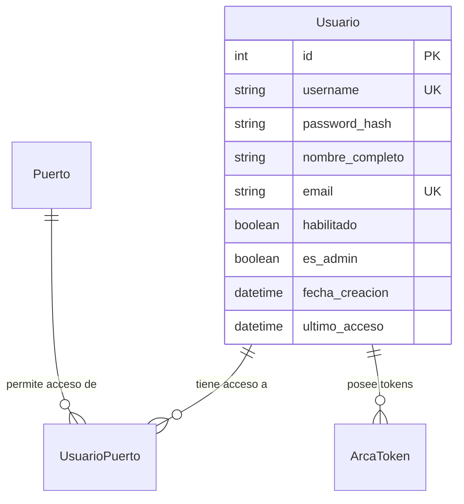

# Sistema de Usuarios - LogiGrain

## 👥 Descripción General

El sistema de usuarios de LogiGrain maneja la autenticación, autorización y permisos de acceso al sistema. Permite gestionar usuarios multipuerto, donde cada usuario puede tener acceso a uno o más puertos/terminales de la empresa.

## 🏗️ Modelo de Datos

### Tabla `usuario`

| Campo | Tipo | Descripción | Características |
|-------|------|-------------|-----------------|
| `id` | Integer | Identificador único | Primary Key, Auto-increment |
| `username` | String(50) | Nombre de usuario | Unique, Index |
| `password_hash` | String(255) | Hash de la contraseña | SHA-256 |
| `nombre_completo` | String(150) | Nombre completo | Obligatorio |
| `email` | String(100) | Correo electrónico | Unique, Index |
| `habilitado` | Boolean | Estado del usuario | Default: True |
| `es_admin` | Boolean | Permisos de administrador | Default: False |
| `fecha_creacion` | DateTime | Fecha de creación | Auto-generado |
| `ultimo_acceso` | DateTime | Último login | Nullable |

### Relaciones



## 🔧 Funcionalidades del Modelo

### Clase `Usuario` (SQLModel)

#### Métodos de Contraseña

```python
def set_password(self, password: str) -> None:
    """Hashea y establece la contraseña"""
    self.password_hash = hashlib.sha256(password.encode()).hexdigest()

def verify_password(self, password: str) -> bool:
    """Verifica si la contraseña es correcta"""
    return self.password_hash == hashlib.sha256(password.encode()).hexdigest()
```

#### Relaciones SQLModel

```python
# Relación con puertos
puertos: List["UsuarioPuerto"] = Relationship(back_populates="usuario")

# Relación con tokens ARCA
arca_tokens: List["ArcaToken"] = Relationship(back_populates="usuario")
```

## 👨‍💼 Tipos de Usuario

### 1. Administrador (`es_admin = True`)
- **Permisos**: Acceso completo al sistema
- **Puertos**: Generalmente todos los puertos
- **Características**: Puede ver logs, diagnosticar sistema, gestionar configuración

### 2. Supervisor
- **Permisos**: Supervisión de operaciones
- **Puertos**: Múltiples puertos según asignación
- **Características**: Acceso a reportes, monitoreo de operaciones

### 3. Operador
- **Permisos**: Operaciones básicas
- **Puertos**: Uno o dos puertos específicos
- **Características**: Operación diaria, ingreso de datos, consultas básicas

### 4. Gerente
- **Permisos**: Visión ejecutiva
- **Puertos**: Puerto específico bajo su gestión
- **Características**: Acceso a reportes ejecutivos, análisis de rendimiento

## 🏢 Sistema Multipuerto

### Concepto
Cada usuario puede tener acceso a múltiples puertos/terminales de la empresa. La asignación se maneja mediante la tabla de relación `UsuarioPuerto`.

### Validación de Acceso
```python
def validate_user_puerto_access(usuario: Usuario, puerto_codigo: str, session: Session) -> bool:
    """Validar que el usuario tenga acceso al puerto especificado"""
    statement = select(UsuarioPuerto, Puerto).join(Puerto).where(
        UsuarioPuerto.usuario_id == usuario.id,
        Puerto.codigo == puerto_codigo,
        UsuarioPuerto.habilitado == True,
        Puerto.habilitado == True
    )
    
    resultado = session.exec(statement).first()
    return resultado is not None
```

### Obtener Puertos del Usuario
```python
# Durante el login
statement_puertos = select(UsuarioPuerto, Puerto).join(Puerto).where(
    UsuarioPuerto.usuario_id == usuario.id,
    UsuarioPuerto.habilitado == True,
    Puerto.habilitado == True
)
```

## 📊 Usuarios de Prueba Predefinidos

### Estructura de Datos

```python
usuarios_prueba = [
    {
        "username": "admin",
        "password": "admin123",
        "nombre_completo": "Administrador Principal",
        "email": "admin@logigrain.com",
        "es_admin": True,
        "puertos": ["TRP1", "TRP2", "TSL1"]  # Todos los puertos
    },
    {
        "username": "operador1", 
        "password": "op123",
        "nombre_completo": "Operador Terminal Norte",
        "email": "operador1@logigrain.com",
        "puertos": ["TRP1", "TRP2"]
    },
    {
        "username": "supervisor",
        "password": "super123", 
        "nombre_completo": "Supervisor Regional",
        "email": "supervisor@logigrain.com",
        "puertos": ["TRP2", "TSL1"]
    },
    {
        "username": "gerente",
        "password": "ger123",
        "nombre_completo": "Gerente Terminal Sur",
        "email": "gerente@logigrain.com", 
        "puertos": ["TSL1"]
    }
]
```

### Matriz de Permisos

| Usuario | TRP1 | TRP2 | TSL1 | Admin |
|---------|------|------|------|-------|
| admin | ✅ | ✅ | ✅ | ✅ |
| operador1 | ✅ | ✅ | ❌ | ❌ |
| supervisor | ❌ | ✅ | ✅ | ❌ |
| gerente | ❌ | ❌ | ✅ | ❌ |

## 🔐 Gestión de Contraseñas

### Algoritmo Actual
- **Hash**: SHA-256
- **Implementación**: `hashlib.sha256(password.encode()).hexdigest()`
- **Almacenamiento**: Hexadecimal en campo `password_hash`

### Mejoras Recomendadas para Producción

```python
# Cambiar a bcrypt para mayor seguridad
from passlib.hash import bcrypt

def set_password(self, password: str) -> None:
    """Versión mejorada con bcrypt"""
    self.password_hash = bcrypt.hash(password)

def verify_password(self, password: str) -> bool:
    """Verificación con bcrypt"""
    return bcrypt.verify(password, self.password_hash)
```

## 📋 DTOs (Data Transfer Objects)

### `UsuarioLogin`
```python
class UsuarioLogin(SQLModel):
    """Modelo para request de login"""
    username: str
    password: str
```

### `UsuarioResponse`
```python
class UsuarioResponse(SQLModel):
    """Modelo para respuesta de usuario (sin contraseña)"""
    id: int
    username: str
    nombre_completo: str
    email: str
    habilitado: bool
    es_admin: bool
    fecha_creacion: datetime
    ultimo_acceso: Optional[datetime]
```

### `LoginResponse`
```python
class LoginResponse(SQLModel):
    """Modelo para respuesta de login exitoso"""
    usuario: UsuarioResponse
    puertos: List[PuertoResponse]
    token: str
    mensaje: str
```

## 🔄 Operaciones Principales

### 1. Creación de Usuario
```python
nuevo_usuario = Usuario(
    username="nuevo_operador",
    nombre_completo="Nuevo Operador Terminal",
    email="nuevo@logigrain.com",
    habilitado=True,
    es_admin=False
)
nuevo_usuario.set_password("password123")
```

### 2. Autenticación
```python
def authenticate_user(username: str, password: str, session: Session):
    statement = select(Usuario).where(Usuario.username == username)
    usuario = session.exec(statement).first()
    
    if not usuario:
        return None
    
    if not usuario.verify_password(password):
        return None
        
    if not usuario.habilitado:
        return None
        
    return usuario
```

### 3. Actualización de Último Acceso
```python
# Durante el login exitoso
usuario.ultimo_acceso = datetime.utcnow()
session.add(usuario)
session.commit()
```

## 📝 Estados del Usuario

### Estados Principales
1. **Activo (`habilitado = True`)**: Usuario puede hacer login
2. **Inactivo (`habilitado = False`)**: Usuario bloqueado, no puede acceder
3. **Admin (`es_admin = True`)**: Permisos administrativos completos

### Validaciones de Estado
```python
# Durante login
if not usuario.habilitado:
    raise HTTPException(
        status_code=403,
        detail="Usuario deshabilitado"
    )

# Durante operaciones administrativas  
if operation_requires_admin and not current_user.es_admin:
    raise HTTPException(
        status_code=403,
        detail="Se requieren permisos de administrador"
    )
```

## 📊 Auditoría y Logging

### Eventos Registrados
- ✅ **Creación de usuario**
- 🔄 **Modificación de permisos**
- 🔐 **Cambios de contraseña**
- 🚪 **Login/logout**
- ⚠️ **Intentos de acceso fallidos**
- 🔒 **Bloqueo/desbloqueo de usuarios**

### Formato de Logs
```
2025-12-30 18:28:08 - main - INFO - Intento de login para usuario: admin
2025-12-30 18:28:08 - main - INFO - Login exitoso para usuario: admin
2025-12-30 18:28:08 - main - WARNING - Usuario deshabilitado: operador_temp
```

## 🚀 Escalabilidad

### Consideraciones para Crecimiento
1. **Índices de BD**: username y email ya indexados
2. **Paginación**: Implementar para listados grandes
3. **Cache de permisos**: Para consultas frecuentes
4. **Roles avanzados**: Sistema de roles más granular

### Migración de Datos
```python
# Script para migrar usuarios desde sistema legacy
def migrate_users_from_legacy(legacy_data):
    for legacy_user in legacy_data:
        nuevo_usuario = Usuario(
            username=legacy_user['login'],
            nombre_completo=legacy_user['nombre'],
            email=legacy_user['email'],
            habilitado=legacy_user['activo']
        )
        nuevo_usuario.set_password(legacy_user['password'])
        # Migrar asignaciones de puerto...
```

## 🧪 Testing

### Casos de Prueba Principales
1. **Creación de usuario**: Validaciones de campos obligatorios
2. **Login**: Credenciales correctas/incorrectas
3. **Permisos multipuerto**: Acceso a puertos asignados/no asignados
4. **Hash de contraseñas**: Verificación de integridad
5. **Estados de usuario**: Activo/inactivo

### Datos de Prueba
Los usuarios de prueba se crean automáticamente mediante `init_db.py` y están listos para usar en development y testing.

## 📚 Referencias

- [SQLModel Documentation](https://sqlmodel.tiangolo.com/) - ORM utilizado
- [Passlib](https://passlib.readthedocs.io/) - Para hashing de contraseñas mejorado
- [FastAPI Users](https://fastapi-users.github.io/) - Alternativa más robusta para producción